# CNN Backpropagation from Scratch

An inspectable convolutional neural network built with **NumPy only** to show exactly how gradients flow through convolution, ReLU, max pooling, flattening, dense layers, and softmax cross-entropy.

[](https://github.com/lkey07/BackPropagation_In_CNNs/actions/workflows/ci.yml)


> The goal is not to replace PyTorch or TensorFlow. It is to make the chain rule visible, debuggable, and numerically verifiable.

## Why this repository is different

Most CNN tutorials call `loss.backward()` and move on. This project exposes the mechanics behind that single line:

- forward and backward passes implemented explicitly for every layer;
- parameter gradients stored separately from optimizer updates;
- stable, fused softmax cross-entropy with the correct batch scaling;
- NCHW convolution supporting configurable kernel, stride, and padding;
- max-pooling gradients routed to exactly one winning activation;
- central finite-difference checks for inputs, weights, and biases;
- optional forward/backward parity verification against PyTorch;
- a dependency-free synthetic training example plus MNIST notebooks;
- automated tests and GitHub Actions across Python 3.10 and 3.12.

## Gradient flow

```mermaid
flowchart LR
    X[Input N×1×28×28] --> C1[Conv2D 1→8]
    C1 --> R1[ReLU]
    R1 --> P1[MaxPool 2×2]
    P1 --> C2[Conv2D 8→16]
    C2 --> R2[ReLU]
    R2 --> P2[MaxPool 2×2]
    P2 --> F[Flatten]
    F --> D1[Dense 784→64]
    D1 --> R3[ReLU]
    R3 --> D2[Dense 64→10]
    D2 --> L[Softmax + Cross-Entropy]

    L -. dL/dz .-> D2
    D2 -. chain rule .-> R3
    R3 -.-> D1
    D1 -.-> F
    F -.-> P2
    P2 -. argmax route .-> R2
    R2 -. ReLU mask .-> C2
    C2 -. dW, db, dX .-> P1
    P1 -.-> R1
    R1 -.-> C1
    C1 -.-> X
```



For a batch of logits \(Z\), probabilities \(P=\operatorname{softmax}(Z)\), and one-hot labels \(Y\), the fused loss gradient is:

$$
\frac{\partial L}{\partial Z}=\frac{P-Y}{N}
$$

That gradient is propagated backward through each layer. For a dense layer \(Z=XW+b\):

$$
\frac{\partial L}{\partial W}=X^T\frac{\partial L}{\partial Z}, \qquad
\frac{\partial L}{\partial b}=\sum_n\frac{\partial L}{\partial Z_n}, \qquad
\frac{\partial L}{\partial X}=\frac{\partial L}{\partial Z}W^T
$$

The convolution implementation applies the same chain rule over every receptive field. See the [Vietnamese derivation](docs/backpropagation-vi.md) for a layer-by-layer explanation.

## Quick start

```bash
git clone https://github.com/lkey07/BackPropagation_In_CNNs.git
cd BackPropagation_In_CNNs
python -m pip install -e ".[dev]"
```

Validate the analytical Conv2D gradients:

```bash
python examples/gradient_check.py
```

Expected result:

```text
 input relative error: 2.289e-10
weight relative error: 1.638e-10
  bias relative error: 1.635e-11
PASS: analytical Conv2D gradients match finite differences.
```

Train an end-to-end CNN on a tiny generated shape dataset—no download required:

```bash
python examples/train_toy.py
```

Run the complete test suite:

```bash
pytest
```

## Use the framework

```python
import numpy as np

from cnn_backprop import SGD, accuracy, build_mnist_cnn, softmax_cross_entropy

model = build_mnist_cnn(seed=42)
optimizer = SGD(learning_rate=0.01, momentum=0.9)

images = np.random.default_rng(0).normal(size=(8, 1, 28, 28))
labels = np.arange(8) % 10

logits = model.forward(images)
loss, gradient = softmax_cross_entropy(logits, labels)
model.backward(gradient)
optimizer.step(model)

print(f"loss={loss:.4f}, accuracy={accuracy(logits, labels):.3f}")
print(f"parameters={model.parameter_count:,}")  # 52,138
```

## Notebook gallery

The original experiments remain available as rendered notebooks. The NumPy architectures are intentionally compact MNIST adaptations, not exact reproductions of the historical production models.

| Notebook | Purpose | Recorded result |
|---|---|---:|
| [`CNN_NumPy_Backprop_Visualization.ipynb`](notebooks/CNN_NumPy_Backprop_Visualization.ipynb) | Visualize activations, input gradients, and the complete manual backward path | Educational 16-image demo |
| [`LeNet5_Style_NumPy_Backprop.ipynb`](notebooks/LeNet5_Style_NumPy_Backprop.ipynb) | LeNet-5-style CNN with explicit NumPy gradients and Adam updates | 1,000-image subset |
| [`MiniAlexNet_NumPy_Backprop.ipynb`](notebooks/MiniAlexNet_NumPy_Backprop.ipynb) | Deeper five-convolution educational network | 82.00% on 200 samples |
| [`CNN_Keras_Autodiff_MNIST.ipynb`](notebooks/CNN_Keras_Autodiff_MNIST.ipynb) | Compare manual gradient flow with TensorFlow `GradientTape` and `model.fit` | 99.09% on 10,000 samples |

Install the optional notebook stack with:

```bash
python -m pip install -e ".[notebooks]"
```

## Repository structure

```text
.
├── src/cnn_backprop/
│   ├── layers.py             # Conv2D, MaxPool2D, ReLU, Flatten, Dense
│   ├── losses.py             # Stable softmax and cross-entropy
│   ├── model.py              # Sequential model and MNIST architecture
│   ├── optim.py              # SGD, momentum, and weight decay
│   └── checks.py             # Numerical-gradient utilities
├── tests/                    # Layer, loss, model, and gradient tests
├── examples/                 # Gradient check and offline toy training
├── notebooks/                # Manual NumPy and TensorFlow experiments
├── docs/                     # Layer-by-layer Vietnamese derivation
├── .github/workflows/ci.yml  # Automated lint and tests
└── pyproject.toml
```

## Verification

The central-difference approximation

$$
\frac{\partial f}{\partial x_i}\approx
\frac{f(x_i+\varepsilon)-f(x_i-\varepsilon)}{2\varepsilon}
$$

is compared against each analytical gradient. The test suite currently covers:

- Conv2D gradients with respect to input, kernel, and bias;
- Conv2D forward and backward parity with PyTorch when it is installed;
- Dense gradients with respect to input and weights;
- softmax cross-entropy stability and gradient correctness;
- max-pool winner routing, ReLU masking, and flatten reshaping;
- optimizer integration and measurable loss reduction.

## Scope and limitations

This is educational software optimized for clarity. The convolution is vectorized over batches and spatial windows, but its backward pass is still far slower than optimized CUDA/cuDNN kernels. The project currently omits mixed precision, dilation, groups, batch normalization, automatic differentiation graphs, and production serialization.
